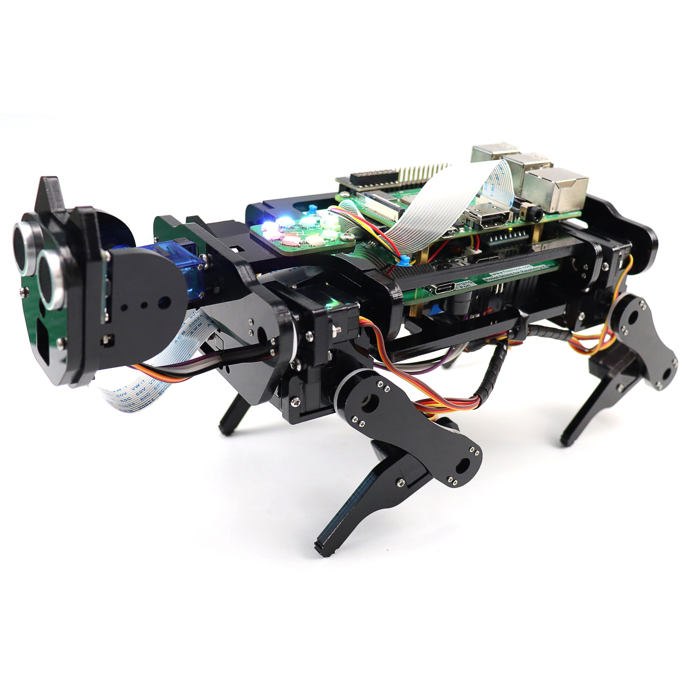

Starter kits
----------------------------------------------------------------

.. table:: Starter kit
    :width: 100%
    :align: center

    ====================================    ===============================================================     ==============================================================================
    Image                                   SKU                                                                 Name
    ====================================    ===============================================================     ==============================================================================
    |FNK0019.MAIN|                          :tutorial-link:`FNK0019 <fnk0019/fnk0019.html>`                     Freenove  Super Starter Kit for Raspberry Pi
    |FNK0020.MAIN|                          :tutorial-link:`FNK0020 <fnk0020/fnk0020.html>`                     Freenove  Ultimate Starter Kit for Raspberry Pi
    |FNK0022.MAIN|                          :tutorial-link:`FNK0022 <fnk0022/fnk0022.html>`                     Freenove  Basic Starter Kit for Raspberry Pi
    |FNK0023.MAIN|                          :tutorial-link:`FNK0023 <fnk0023/fnk0023.html>`                     Freenove  LCD1602 Starter Kit for Raspberry Pi
    |FNK0024.MAIN|                          :tutorial-link:`FNK0024 <fnk0024/fnk0024.html>`                     Freenove  Ultrasonic Starter Kit for Raspberry Pi
    |FNK0025.MAIN|                          :tutorial-link:`FNK0025 <fnk0025/fnk0025.html>`                     Freenove  RFID Starter Kit for Raspberry Pi
    |FNK0066.MAIN|                          :tutorial-link:`FNK0066 <fnk0066/fnk0066.html>`                     Freenove  Complete Starter Kit for Raspberry Pi
    ====================================    ===============================================================     ==============================================================================

.. |FNK0019.MAIN| image:: ../_static/products/FNK0019.MAIN.jpg    
    :height: 120px
.. |FNK0020.MAIN| image:: ../_static/products/FNK0020.MAIN.jpg    
    :height: 120px
.. |FNK0022.MAIN| image:: ../_static/products/FNK0022.MAIN.jpg    
    :height: 120px
.. |FNK0023.MAIN| image:: ../_static/products/FNK0023.MAIN.jpg    
    :height: 120px
.. |FNK0024.MAIN| image:: ../_static/products/FNK0024.MAIN.jpg    
    :height: 120px
.. |FNK0025.MAIN| image:: ../_static/products/FNK0025.MAIN.jpg    
    :height: 120px
.. |FNK0066.MAIN| image:: ../_static/products/FNK0066.MAIN.jpg    
    :height: 120px

Robotics kits
----------------------------------------------------------------
.. table:: Robotics kit
    :width: 100%
    :align: center

    ====================================    ===============================================================     ==============================================================================
    Image                                   SKU                                                                 Name
    ====================================    ===============================================================     ==============================================================================
    |FNK0021.MAIN|                          :tutorial-link:`FNK0021 <fnk0019/fnk0019.html>`                     Freenove Three-wheeled Smart Car Kit for Raspberry Pi
    |FNK0036.MAIN|                          :tutorial-link:`FNK0036 <fnk0020/fnk0020.html>`                     Freenove Robot Arm Kit for Raspberry Pi
    |FNK0043.MAIN|                          :tutorial-link:`FNK0043 <fnk0022/fnk0022.html>`                     Freenove 4WD Smart Car Kit for Raspberry Pi
    |FNK0043B.MAIN|                         :tutorial-link:`FNK0043B <fnk0022/fnk0022.html>`                    Freenove 4MWD Smart Car Kit for Raspberry Pi
    |FNK0050.MAIN|                          :tutorial-link:`FNK0050 <fnk0023/fnk0023.html>`                     Freenove Robot Dog Kit for Raspberry Pi
    |FNK0052.MAIN|                          :tutorial-link:`FNK0052 <fnk0024/fnk0024.html>`                     Freenove Big Hexapod Robot Kit for Raspberry Pi
    |FNK0077.MAIN|                          :tutorial-link:`FNK0077 <fnk0025/fnk0025.html>`                     Freenove Tank Robot Kit for Raspberry Pi
    ====================================    ===============================================================     ==============================================================================

.. |FNK0021.MAIN| image:: ../_static/products/FNK0021.MAIN.jpg
    :height: 120px
.. |FNK0036.MAIN| image:: ../_static/products/FNK0036.MAIN.jpg
    :height: 120px
.. |FNK0043.MAIN| image:: ../_static/products/FNK0043.MAIN.jpg    
    :height: 120px
.. |FNK0043B.MAIN| image:: ../_static/products/FNK0043B.MAIN.jpg    
    :height: 120px

.. |FNK0052.MAIN| image:: ../_static/products/FNK0052.MAIN.jpg    
    :height: 120px
.. |FNK0077.MAIN| image:: ../_static/products/FNK0077.MAIN.jpg    
    :height: 120px

