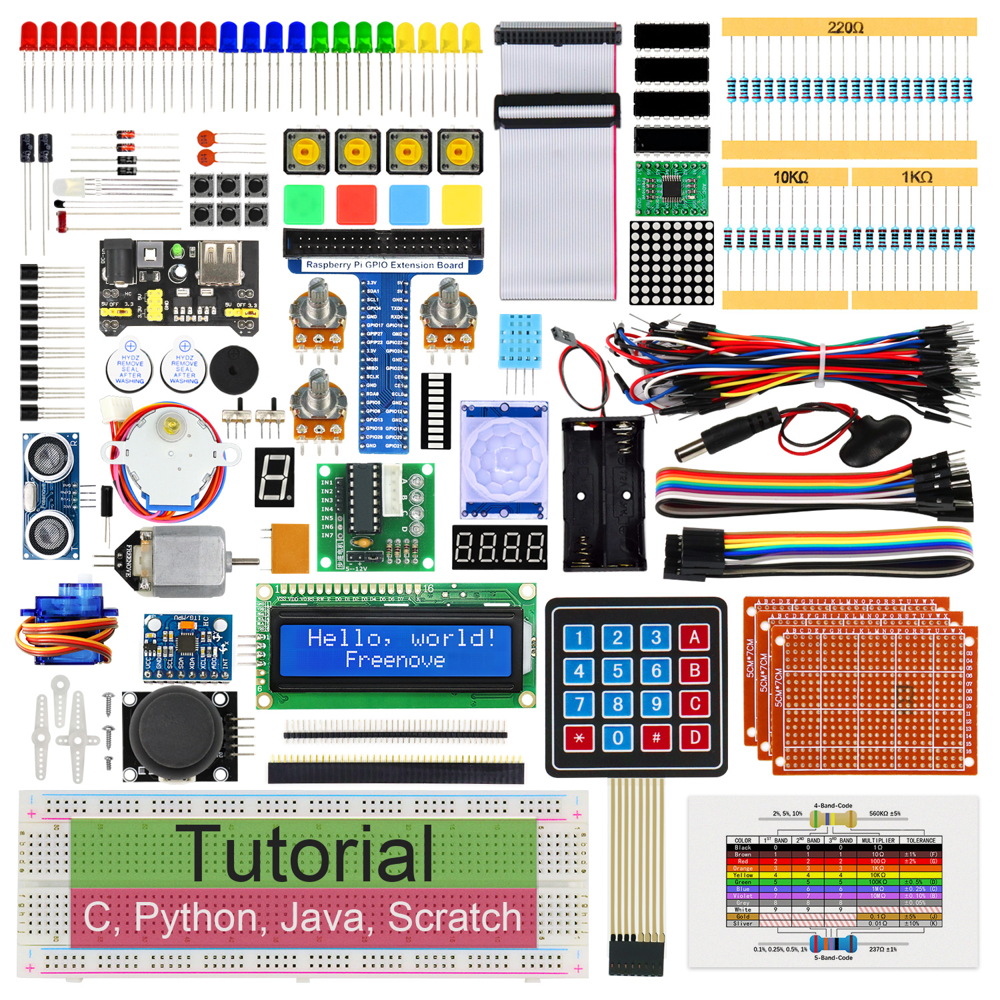
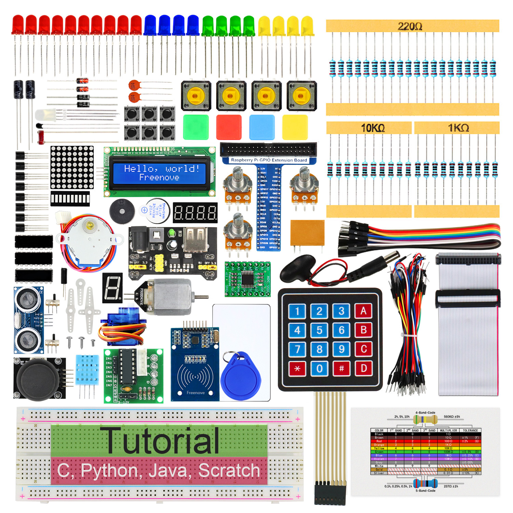
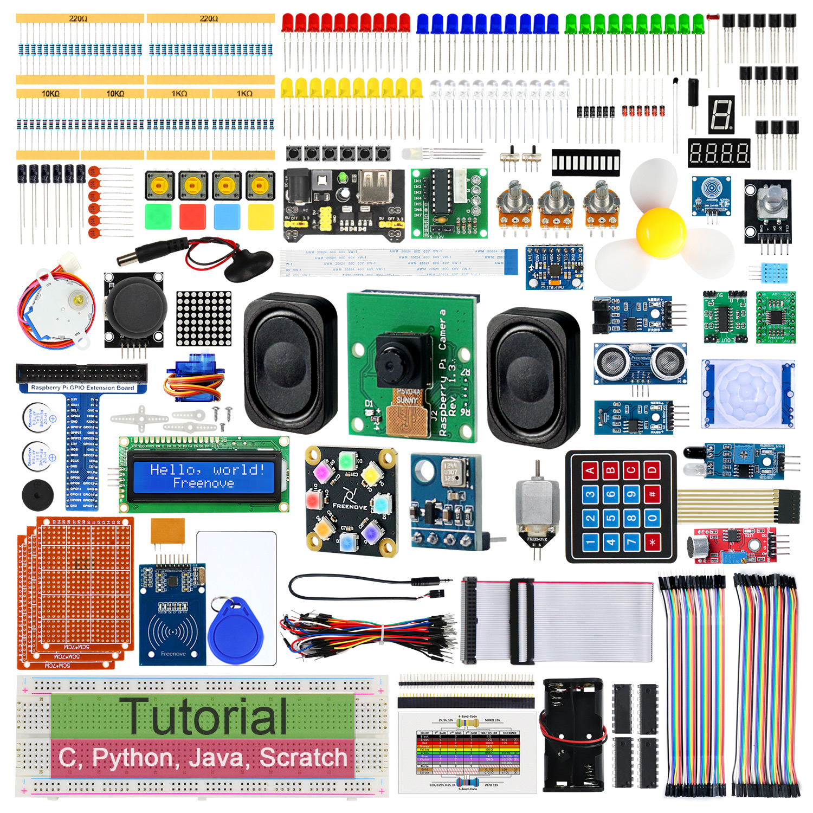

# Select products
 
## RaspberryPi Series 
| Product                                                      | SKU                                   | Title                                           |
| ------------------------------------------------------------ | ------------------------------------- | ----------------------------------------------- |
|  | [FNK0020]()                           | Freenove  Ultimate Starter Kit for Raspberry Pi |
|  | [FNK0025]()                           | Freenove  RFID Starter Kit for Raspberry Pi     |
|  | [FNK0066](http://127.0.0.1:8001/index.html) | Freenove  Complete Starter Kit for Raspberry Pi |

## Arduino Series 

> [!NOTE]  
> Highlights information that users should take into account, even when skimming.

## ESP32 Series 

## ESP32-S3 Series 

## ESP8266 Series 

## RaspberryPi pico(w) Series 

## BBC micro:bit Series 

## Arduino Series 

